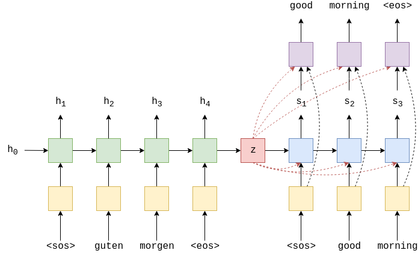

# Assignment 9:

This assignment aims to train Sequence to Sequence models on chatbot datasets

## Models Used

1. Learning Phrase Representations using RNN Encoder-Decoder for Statistical Machine Translation

2. Neural Machine Translation by Jointly Learning to Align and Translate

## Model Architecture

### Learning Phrase Representations using RNN Encoder-Decoder for Statistical Machine Translation

In this RNN Encoder-Decoder based approach, the decoder takes the context vector (generated from encoder) along with embedded input token and previous hidden state to predict the next hidden state. The context vector is fed to the linear layer along with hidden output to predict the next token.

### Neural Machine Translation by Jointly Learning to Align and Translate

The previous models for neural machine translation uses encoder-decoder architecture and consists of an encoder that encodes the source sentence into a fixed length context vector from which decoder generates the translation. This model puts forth that the use of a fixed length context vector is a bottleneck in improving the performance of this basic encoder-decoder architecture. It proposes to extend this by allowing a model to automatically (soft-)search for parts of a source sentence that are relevant to predicting a target word, without having to form these parts as a hard segment explicitly.

Encoder uses bidirectional GRU to encode the context vector. Bidirection GRUs create 2 context vector, one for each direction. Decoder block requires single context vector. This is created by concatenating the two context vectors together, passing them through a linear layer and applying the tanh activation function.

Attention vector is calculated from previous hidden state of the decoder, st−1 , and all of the stacked forward and backward hidden states from the encoder. Attention vector calculates how well each encoder hidden state matches the previous decoder hidden state.

Decoder uses the weighted attention vector along with previous decoder hidden state to calculate decoder hidden state. Attention vector is also used along with decoder hidden state to predict the next word.

## Datasets

1. Twitter Customer Dataset
2. NarrativeQA Dataset
3. AmbiQ Dataset

- You can know more about the datasets from [here](https://kili-technology.com/blog/chatbot-training-datasets/)

